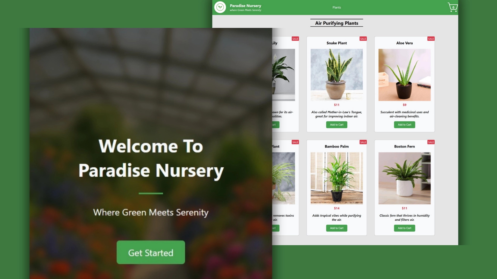

# Paradise Nursery 🌿

A front-end e-commerce application for a fictional plant shop, built with **React** and **Redux Toolkit**. This project was the final capstone for IBM’s *Developing Front-End Apps with React* course.

## Live Preview 🌍

🔗 [Live Demo](https://paradise-nursery-by-beniamin.vercel.app)

## Features ✅

1. 🏠 **Landing Page** with a welcoming message, background image, and CTA button.
2. 🪴 **Product Listing Page** showing all available plants with category filters.
3. 🛒 **Cart Functionality** to add, remove, and update plant quantities in real time.
4. 📦 **Cart Summary Page** with total item count and checkout mockup.
5. 📱 **Fully responsive layout** for mobile and desktop.

## Mockup 📸

## What I Learned 📚

1️⃣ **Redux Toolkit Usage:**
   - Replaced React Context with **Redux Toolkit** for global state management.
   - Created a centralized store and integrated it seamlessly into the app.

2️⃣ **Custom Reducers Implementation:**
   - Developed `cartSlice.js` with four core reducers:
     - `addToCart`
     - `removeFromCart`
     - `increaseQuantity`
     - `decreaseQuantity`

3️⃣ **Scalable Architecture:**
   - Designed a modular folder structure for scalability and maintainability.
   - Clearly separated UI components, Redux logic, and routing configurations.

4️⃣ **Integration with External Services:**
   - Used `Axios` library to fetch product data from a remote JSON server.
   - Handled async flows efficiently using Redux and `useEffect`.

## Technologies Used 🛠️

- ⚛️ React
- 🧰 Redux Toolkit
- 🌐 React Router DOM
- 📡 Axios Library
- 🎨 CSS Variables
- 🚀 Vercel

## Conclusion 🎉

Built with care by **Beniamin Hekimian**. For feedback or collaboration, feel free to reach out! ✉️